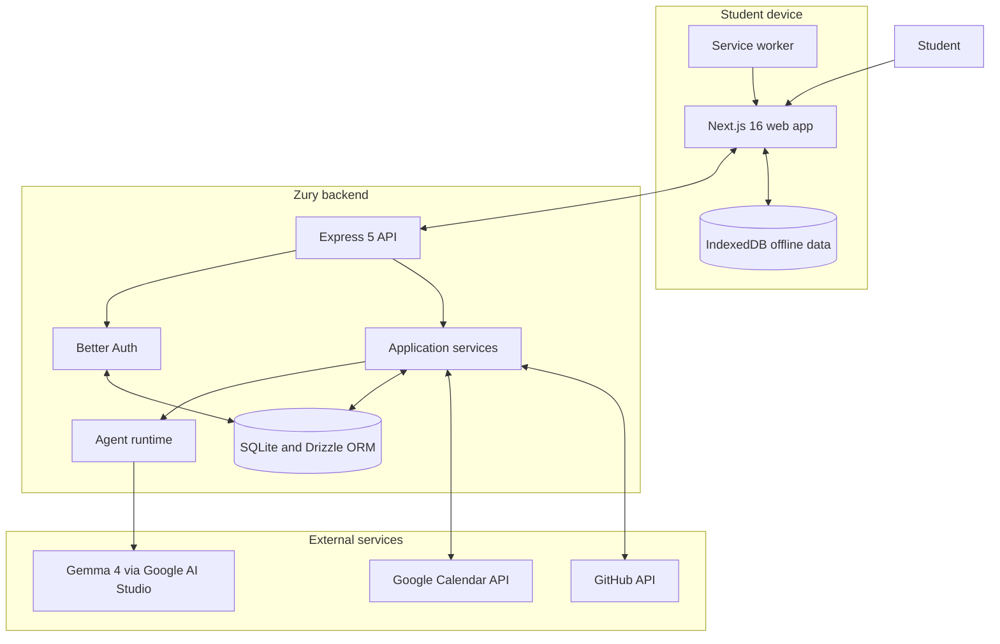
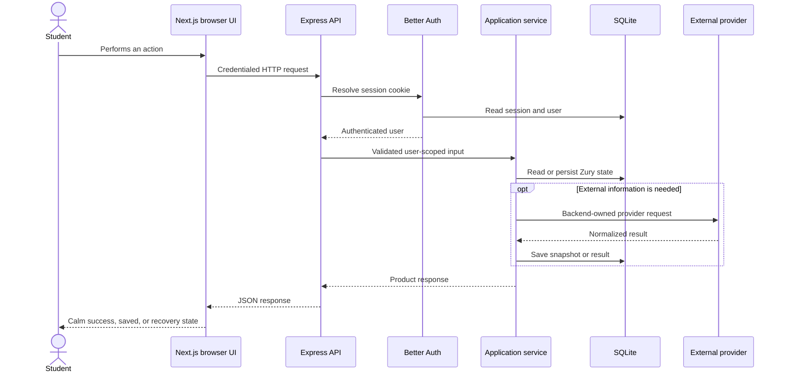
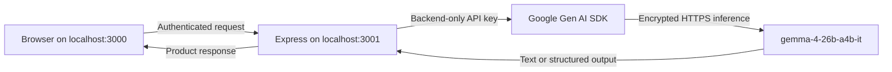
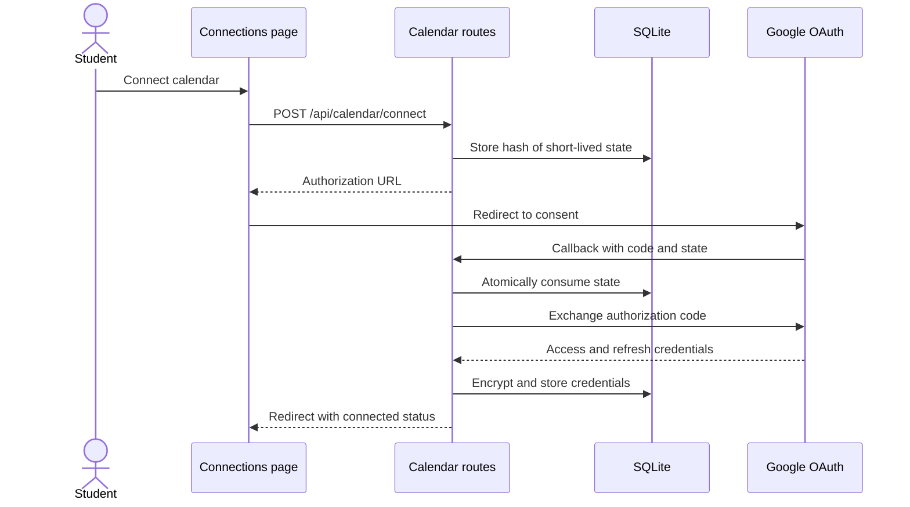
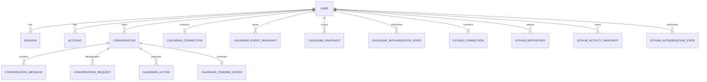
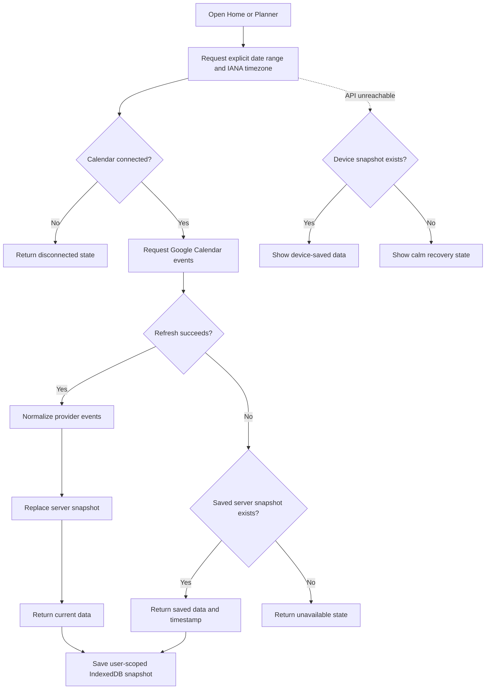
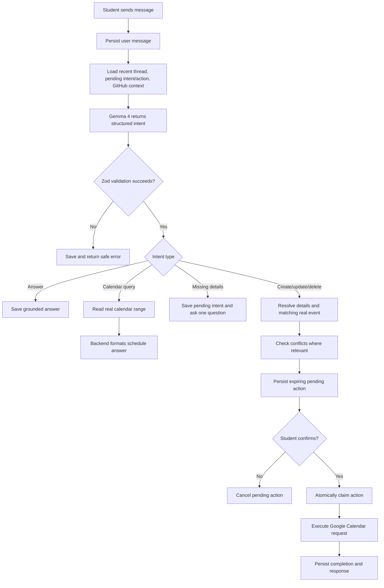
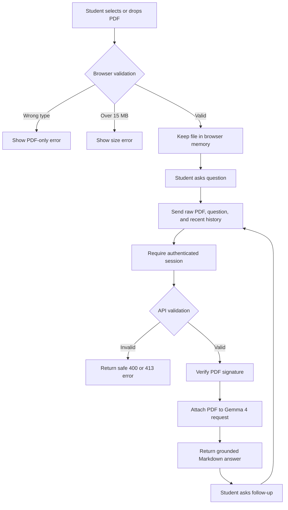

# Zury

Zury is an offline-aware personal academic companion for university students. It
combines a daily schedule, weekly planning, PDF-based study help, conversational
calendar actions, and optional project context in one focused web application.

> Your day, your studies and your next move, together in one calm place.

Zury is designed first for students who may move between desktop and mobile or
work with expensive, slow, or unreliable connectivity. The application keeps
useful saved information available, labels whether external data is current or
saved, and queues safe conversation messages until connectivity returns.

## Table of contents

- [What Zury does](#what-zury-does)
- [Application pages](#application-pages)
- [Architecture](#architecture)
- [How a request moves through Zury](#how-a-request-moves-through-zury)
- [Technology stack](#technology-stack)
- [Repository structure](#repository-structure)
- [Prerequisites](#prerequisites)
- [Quick start](#quick-start)
- [Environment configuration](#environment-configuration)
- [Gemma 4 setup with Google AI Studio](#gemma-4-setup-with-google-ai-studio)
- [Google authentication setup](#google-authentication-setup)
- [Google Calendar setup](#google-calendar-setup)
- [GitHub setup](#github-setup)
- [Database and migrations](#database-and-migrations)
- [Running the application](#running-the-application)
- [Testing and verification](#testing-and-verification)
- [Feature flows](#feature-flows)
- [Offline and PWA behavior](#offline-and-pwa-behavior)
- [API reference](#api-reference)
- [Security and privacy boundaries](#security-and-privacy-boundaries)
- [Production notes](#production-notes)
- [Troubleshooting](#troubleshooting)
- [Further documentation](#further-documentation)

## What Zury does

Zury currently provides:

- A protected daily dashboard with today's calendar and selected GitHub activity.
- A weekly planner backed by Google Calendar.
- A Study workspace where a student uploads a PDF and asks grounded questions.
- A conversational assistant powered by Gemma 4 through Google AI Studio.
- Natural-language calendar queries and confirmed create, update, and delete actions.
- Conflict detection before proposed calendar changes are confirmed.
- Optional, read-only GitHub project context for selected repositories.
- Offline snapshots for the dashboard and planner.
- Offline conversation drafts and an outgoing-message queue.
- Installable PWA behavior with a navigation fallback when offline.
- Account, appearance, connected-app, local-data, and session settings.

The product deliberately separates identity, connected apps, and AI inference:

- Signing in identifies the Zury user.
- Connecting Calendar grants calendar access separately.
- Connecting GitHub grants optional read-only project access separately.
- Google AI Studio processes AI requests but does not authenticate the student.

## Application pages

| Page | Route | Purpose |
| --- | --- | --- |
| Landing | `/` | Product introduction and entry into Zury |
| Sign in | `/sign-in` | Google or email/password authentication |
| Home | `/dashboard` | Today's briefing, events, and project context |
| Planner | `/dashboard/planner` | Seven-day calendar and daily agenda |
| Study | `/dashboard/study` | Upload a PDF and ask document-grounded questions |
| Conversation | `/dashboard/conversation` | Ask questions and manage calendar actions |
| Connections | `/dashboard/connections` | Connect Calendar and GitHub, then select projects |
| Settings | `/dashboard/settings` | Account, appearance, local data, connections, and sign out |
| Offline | `/offline` | PWA navigation fallback when the network is unavailable |

Every dashboard route is authenticated by the server-side dashboard layout. An
unauthenticated request is redirected to `/sign-in`.

## Architecture

Zury is a pnpm/Turborepo monorepo containing a Next.js frontend, an Express API,
a shared TypeScript package, and a local SQLite database.



### Architectural boundaries

- **The Express API is the system boundary.** It owns authentication, validation,
  business rules, persistence, external credentials, and provider calls.
- **The frontend never accesses SQLite or provider secrets.** It communicates
  with Express using credentialed HTTP requests.
- **SQLite is the server-side source of truth.** Calendar and GitHub are external
  synchronization sources, not Zury's application database.
- **IndexedDB is device-local resilience.** It stores user-scoped snapshots,
  drafts, cached conversation copies, and pending outgoing messages.
- **AI output is not trusted directly.** Structured intent output is parsed and
  validated before it can select a calendar operation.
- **Calendar writes require confirmation.** The model proposes an intent; backend
  code resolves the event and performs the write only after user confirmation.
- **Connected-app credentials remain backend-owned.** Calendar and GitHub tokens
  are encrypted before storage and are never returned to the browser.

## How a request moves through Zury



The API applies middleware in this order:

1. Request logging.
2. CORS restricted to `WEB_URL`, with credentials enabled.
3. Better Auth's raw request handler under `/api/auth/*`.
4. JSON body parsing for normal API requests.
5. Session resolution.
6. Application routes and per-route authorization.
7. Not-found and centralized error handling.

## Technology stack

### Frontend

- Next.js 16 App Router and Turbopack
- React 19
- TypeScript with strict compiler settings
- Tailwind CSS 4
- Framer Motion
- `next-themes`
- `react-markdown`, KaTeX, and Remark Math
- Browser IndexedDB
- Service Worker and Web App Manifest

### Backend

- Node.js and TypeScript
- Express 5
- Better Auth
- Drizzle ORM
- `better-sqlite3` in WAL mode
- Zod validation
- Google Gen AI SDK (`@google/genai`)
- Google APIs SDK for Calendar
- Native `fetch` for GitHub
- AES-256-GCM credential encryption

### Workspace

- pnpm workspaces
- Turborepo
- Shared TypeScript types, schemas, constants, and utilities
- Node's built-in test runner through `tsx --test`

## Repository structure

```text
zury/
|-- apps/
|   |-- api/
|   |   |-- db/                         # Local SQLite files, ignored by Git
|   |   |-- src/
|   |   |   |-- agent/                  # Provider-neutral runtime
|   |   |   |-- ai/                     # AI interfaces and providers
|   |   |   |-- auth/                   # Better Auth and auth middleware
|   |   |   |-- calendar/               # Calendar service, repository, provider
|   |   |   |-- conversation/           # Threads, messages, actions, intent flow
|   |   |   |-- db/                     # Drizzle schema and migrations
|   |   |   |-- github/                 # Read-only project integration
|   |   |   |-- routes/                 # HTTP route adapters
|   |   |   |-- study/                  # PDF study service
|   |   |   |-- app.ts                  # Express composition and middleware
|   |   |   |-- composition.ts          # Application dependency composition
|   |   |   `-- server.ts               # API process entry point
|   |   |-- .env.example
|   |   `-- package.json
|   `-- web/
|       |-- public/sw.js                 # Service worker
|       |-- src/app/                     # Next.js routes and dashboard features
|       |-- src/components/              # Shared web components
|       |-- src/lib/                     # API and auth clients
|       |-- .env.example
|       `-- package.json
|-- packages/
|   `-- shared/                          # Cross-workspace TypeScript modules
|-- docs/                                # Product and technical design documents
|-- package.json                         # Root scripts
|-- pnpm-workspace.yaml
|-- turbo.json
`-- tsconfig.json
```

## Prerequisites

Install or obtain:

- Node.js 20.9 or newer. A current Node.js LTS release is recommended.
- pnpm 11.5.2, matching the root `packageManager` declaration.
- OpenSSL, used to generate local secrets.
- A Google AI Studio API key with access to Gemma 4.
- A Google OAuth web client for sign-in.
- A separate Google OAuth web client with Calendar API access.
- Optionally, a GitHub OAuth App for project context.

Enable pnpm through Corepack if it is not already installed:

```bash
corepack enable
corepack prepare pnpm@11.5.2 --activate
```

Confirm the tools:

```bash
node --version
pnpm --version
openssl version
```

## Quick start

### 1. Install dependencies

From the repository root:

```bash
pnpm install
```

### 2. Create environment files

```bash
cp apps/api/.env.example apps/api/.env
cp apps/web/.env.example apps/web/.env
```

Fill in `apps/api/.env` as described in
[Environment configuration](#environment-configuration). For Gemma 4, the AI
portion is:

```env
AI_PROVIDER=google
GOOGLE_AI_API_KEY=your-google-ai-studio-api-key
GOOGLE_AI_MODEL=gemma-4-26b-a4b-it
```

The web file should contain:

```env
NEXT_PUBLIC_API_URL=http://localhost:3001
```

### 3. Apply database migrations

```bash
pnpm --filter @zury/api db:migrate
```

The API resolves `DATABASE_URL` relative to `apps/api`, so the default creates
`apps/api/db/zury.sqlite`.

### 4. Start both applications

```bash
pnpm dev
```

Open:

- Web application: <http://localhost:3000>
- API health endpoint: <http://localhost:3001/health>

The expected health response is:

```json
{ "status": "ok" }
```

### 5. Sign in and connect optional sources

1. Open `http://localhost:3000/sign-in`.
2. Sign in with Google or create an email/password account.
3. Open **Connections** to connect Calendar.
4. Optionally connect GitHub and select relevant repositories.
5. Open **Study** to upload a PDF, or **Conversation** to ask Zury something.

## Environment configuration

### Backend: `apps/api/.env`

```env
PORT=3001
DATABASE_URL=./db/zury.sqlite

BETTER_AUTH_SECRET=replace-with-at-least-32-random-characters
BETTER_AUTH_URL=http://localhost:3001

GOOGLE_CLIENT_ID=
GOOGLE_CLIENT_SECRET=

GOOGLE_CALENDAR_CLIENT_ID=
GOOGLE_CALENDAR_CLIENT_SECRET=
GOOGLE_CALENDAR_REDIRECT_URI=http://localhost:3001/api/calendar/callback
CALENDAR_TOKEN_ENCRYPTION_KEY=

GITHUB_CLIENT_ID=
GITHUB_CLIENT_SECRET=
GITHUB_REDIRECT_URI=http://localhost:3001/api/github/callback

AI_PROVIDER=google
GOOGLE_AI_API_KEY=
GOOGLE_AI_MODEL=gemma-4-26b-a4b-it

WEB_URL=http://localhost:3000
NODE_ENV=development
```

| Variable | Required | Description |
| --- | --- | --- |
| `PORT` | No | Express port; defaults to `3001` |
| `DATABASE_URL` | Yes | SQLite path, resolved from the API package directory |
| `BETTER_AUTH_SECRET` | Yes | Better Auth signing secret, at least 32 characters |
| `BETTER_AUTH_URL` | Yes | Public base URL of the API/auth server |
| `GOOGLE_CLIENT_ID` | Yes | Google OAuth client used for Zury sign-in |
| `GOOGLE_CLIENT_SECRET` | Yes | Secret for the sign-in OAuth client |
| `GOOGLE_CALENDAR_CLIENT_ID` | Yes at startup | Separate OAuth client for Calendar access |
| `GOOGLE_CALENDAR_CLIENT_SECRET` | Yes at startup | Calendar OAuth client secret |
| `GOOGLE_CALENDAR_REDIRECT_URI` | Yes at startup | Exact Calendar callback URL |
| `CALENDAR_TOKEN_ENCRYPTION_KEY` | Yes at startup | Base64-encoded 32-byte key for connected-app credentials |
| `GITHUB_CLIENT_ID` | No | GitHub OAuth App client ID |
| `GITHUB_CLIENT_SECRET` | No | GitHub OAuth App client secret |
| `GITHUB_REDIRECT_URI` | No | Exact GitHub callback URL |
| `AI_PROVIDER` | No | `google` or placeholder `ollama`; defaults to `google` |
| `GOOGLE_AI_API_KEY` | Yes for Google AI | Google AI Studio key used only by the API |
| `GOOGLE_AI_MODEL` | No | Model identifier; use `gemma-4-26b-a4b-it` for Gemma 4 |
| `WEB_URL` | No | Allowed CORS origin and OAuth redirect destination |
| `NODE_ENV` | No | `development`, `production`, or `test` |

Generate the two local secrets independently:

```bash
openssl rand -base64 48
openssl rand -base64 32
```

Use the first output for `BETTER_AUTH_SECRET` and the second for
`CALENDAR_TOKEN_ENCRYPTION_KEY`.

Although GitHub is optional, Calendar configuration is currently composed when
the API starts. Valid Calendar variables and an encryption key are therefore
required even before a user connects a calendar.

### Frontend: `apps/web/.env`

```env
NEXT_PUBLIC_API_URL=http://localhost:3001
```

`NEXT_PUBLIC_API_URL` is intentionally public. It contains only the API location,
never credentials. All secret environment variables belong in `apps/api/.env`.

## Gemma 4 setup with Google AI Studio

Zury uses Gemma 4 as a cloud model through the existing Google Gen AI SDK. The
web and API processes run locally, while document and conversation inference run
in Google's cloud. You do not need to download or locally host the 26B model.



### Obtain and configure the key

1. Open [Google AI Studio](https://aistudio.google.com/).
2. Create or select a Google Cloud project.
3. Create an API key.
4. Ensure `gemma-4-26b-a4b-it` is available to the key/project.
5. Place the key only in `apps/api/.env`.

```env
AI_PROVIDER=google
GOOGLE_AI_API_KEY=your-key
GOOGLE_AI_MODEL=gemma-4-26b-a4b-it
```

Restart the API after changing model configuration.

### How Zury uses Gemma 4

| Feature | Model input | Model output | Backend safeguard |
| --- | --- | --- | --- |
| Conversation | User message, recent thread, timezone, pending intent, saved context | Structured intent JSON | Zod discriminated-union validation |
| Calendar query | Natural-language date request | Explicit query range | Backend fetches and formats real events |
| Calendar mutation | Proposed create/update/delete intent | Typed proposed action | Conflict checks and explicit confirmation |
| GitHub question | Normalized selected-project activity | Grounded answer intent | Only backend-supplied activity may be used |
| Study | PDF bytes, question, recent study messages | Markdown answer | PDF validation and grounding instruction |

The model never receives provider access tokens. It does not call Calendar,
GitHub, SQLite, or the browser directly.

### Model behavior requirement

Conversation depends on reliable JSON generation. Zury asks the provider for one
JSON object, parses it, and validates it with Zod. If the response is missing,
malformed, or does not match an allowed intent, Zury returns a safe error instead
of guessing or executing an action.

The configured key and `gemma-4-26b-a4b-it` model have been verified with both a
plain text request and inline PDF input in this project environment.

## Google authentication setup

Google sign-in and Google Calendar are intentionally separate OAuth clients.
Signing in with Google must not silently grant Calendar access.

### Create the sign-in client

1. Open Google Cloud Console.
2. Configure the OAuth consent screen for the project.
3. Create an OAuth 2.0 Client ID with application type **Web application**.
4. Add `http://localhost:3000` as an authorized JavaScript origin if requested.
5. Add Better Auth's Google callback URI shown by your auth configuration. For
   the default Better Auth path, this is normally:

```text
http://localhost:3001/api/auth/callback/google
```

6. Set the resulting values:

```env
GOOGLE_CLIENT_ID=your-sign-in-client-id
GOOGLE_CLIENT_SECRET=your-sign-in-client-secret
```

Always copy the callback shown by Google/Better Auth exactly. Scheme, hostname,
port, path, and trailing slash differences can cause `redirect_uri_mismatch`.

### Email and password

Better Auth also enables email/password registration and sign-in. Both methods
create the same application-level user/session records in SQLite.

## Google Calendar setup

### Cloud configuration

1. Enable the **Google Calendar API** in Google Cloud Console.
2. Create another OAuth 2.0 Web application client.
3. Add this exact local redirect URI:

```text
http://localhost:3001/api/calendar/callback
```

4. Add the credentials and generated encryption key to `apps/api/.env`:

```env
GOOGLE_CALENDAR_CLIENT_ID=your-calendar-client-id
GOOGLE_CALENDAR_CLIENT_SECRET=your-calendar-client-secret
GOOGLE_CALENDAR_REDIRECT_URI=http://localhost:3001/api/calendar/callback
CALENDAR_TOKEN_ENCRYPTION_KEY=base64-encoded-32-byte-key
```

The integration requests the `calendar.events` scope, which supports reading and
writing events. Existing credentials with only read access must be reconnected
before Zury can create, update, or delete events.

### Authorization flow



Calendar state values exposed to product features are:

- `disconnected`: no Calendar connection exists.
- `current`: Google refreshed successfully.
- `saved`: refresh failed, but a server-side snapshot exists.
- `unavailable`: refresh failed and no saved snapshot exists.
- `reconnect_required`: Google rejected credentials; saved data may still appear.
- `device_saved`: the API was unreachable and the browser used IndexedDB.

## GitHub setup

GitHub is optional. If all three GitHub variables are absent, Zury starts without
the GitHub service and returns a disconnected state.

### Create an OAuth App

1. In GitHub, open **Settings > Developer settings > OAuth Apps**.
2. Create a new OAuth App.
3. Use `http://localhost:3000` as the homepage URL.
4. Use this exact authorization callback URL:

```text
http://localhost:3001/api/github/callback
```

5. Set:

```env
GITHUB_CLIENT_ID=your-github-client-id
GITHUB_CLIENT_SECRET=your-github-client-secret
GITHUB_REDIRECT_URI=http://localhost:3001/api/github/callback
```

GitHub tokens use `CALENDAR_TOKEN_ENCRYPTION_KEY` as the common connected-app
encryption key. The OAuth request uses `read:user repo` so users can select from
repositories visible to their account. Zury implements no GitHub write action.

### Data flow

1. The user connects GitHub.
2. Zury stores the encrypted access token.
3. The Connections page fetches available repositories.
4. The user selects up to 20 projects.
5. Zury requests commits and pull requests only for selected repositories.
6. Successful activity is saved as a snapshot.
7. If GitHub is unavailable, saved activity is returned with a `saved` state.

## Database and migrations

Zury uses SQLite through `better-sqlite3` and Drizzle ORM. On startup the database
enables:

```text
journal_mode = WAL
foreign_keys = ON
```

### Apply existing migrations

```bash
pnpm --filter @zury/api db:migrate
```

### Schema development commands

```bash
pnpm --filter @zury/api db:generate
pnpm --filter @zury/api db:push
pnpm --filter @zury/api db:studio
```

- Use `db:generate` after an intentional schema change to create a migration.
- Use `db:migrate` to apply checked-in migrations.
- Use `db:push` only for deliberate local schema prototyping.
- Use `db:studio` to inspect local data through Drizzle Studio.

Do not commit `.env` files or SQLite database files. They are ignored by the root
`.gitignore`.

### Main table groups



| Group | Responsibility |
| --- | --- |
| `user`, `session`, `account`, `verification` | Better Auth identity and sessions |
| `calendar_connection` | Encrypted Calendar credentials and status |
| `calendar_event_snapshot`, `calendar_snapshot` | Saved calendar ranges and freshness |
| `calendar_authorization_state` | Hashed, expiring, single-use OAuth state |
| `conversation`, `conversation_message` | Persistent user conversation threads |
| `conversation_request` | Idempotency for retried offline messages |
| `calendar_action` | Pending, claimed, completed, failed, or cancelled writes |
| `calendar_pending_intent` | Incomplete multi-turn calendar details |
| `github_connection` | Encrypted GitHub credential and status |
| `github_repository` | Repository metadata and user selection |
| `github_activity_snapshot` | Last successful selected-project activity |
| `github_authorization_state` | Hashed, expiring OAuth state |

Study PDFs and Study page messages are not persisted in SQLite.

## Running the application

### Run everything in development

```bash
pnpm dev
```

Turborepo starts the persistent development tasks for the web and API packages.

### Run one application

```bash
pnpm dev:web
pnpm dev:api
```

Use separate terminals if you run both commands individually.

### Build one package at a time

```bash
pnpm --filter @zury/api build
pnpm --filter @zury/web build
```

Building one package at a time can make failures easier to isolate and requires
less peak memory than running the full Turbo build concurrently.

### Start production builds locally

After building, use two terminals:

```bash
pnpm --filter @zury/api start
```

```bash
pnpm --filter @zury/web start
```

Set production URLs and `NODE_ENV=production` before using these commands as an
actual deployment.

### Root scripts

| Command | Action |
| --- | --- |
| `pnpm dev` | Run all workspace development tasks |
| `pnpm dev:web` | Run only Next.js development |
| `pnpm dev:api` | Run only the Express watcher |
| `pnpm build` | Build workspace packages through Turbo |
| `pnpm typecheck` | Typecheck workspace packages through Turbo |
| `pnpm lint` | Run configured workspace lint tasks |
| `pnpm clean` | Remove workspace build output |

## Testing and verification

Run checks one at a time:

```bash
pnpm --filter @zury/shared typecheck
pnpm --filter @zury/api typecheck
pnpm --filter @zury/web typecheck
pnpm --filter @zury/api test
pnpm --filter @zury/api build
pnpm --filter @zury/web build
```

The current API suite covers:

- Agent runtime delegation and provider error mapping.
- The explicit placeholder status of the Ollama provider.
- OAuth state expiration and consumption.
- Calendar range validation and daylight-saving boundaries.
- Google Calendar event normalization.
- Live, saved, disconnected, unavailable, and reconnect-required calendar states.
- Calendar conflict detection.
- Conversation intent handling and grounded GitHub context.
- Confirmation before create, update, or delete calendar operations.
- GitHub authorization URL permissions.
- Study PDF signature validation and document forwarding.

At the time this README was written, verification completed with:

- Shared, API, and web typechecks passing.
- 24 API tests passing with 0 failures.
- API production build passing.
- Web production build passing with all dashboard routes recognized.

### Recommended manual QA

Automated tests do not replace browser/provider testing. Verify:

1. Google and email/password sign-in.
2. Calendar connect, callback, refresh, reconnect, and disconnect.
3. Calendar create, update, and delete confirmation flows.
4. Conflict display for overlapping events.
5. GitHub connect, project selection, saved activity, and disconnect.
6. PDF upload, invalid file rejection, oversize rejection, and follow-up questions.
7. Dashboard and planner fallback after toggling the browser offline.
8. Queued conversation messages after connectivity returns.
9. PWA installation and `/offline` navigation fallback.
10. Settings local-data clearing and sign out.

## Feature flows

### Daily dashboard and planner



The Today endpoint also retrieves selected GitHub activity for the same date
range when GitHub is configured and connected.

### Conversation and calendar actions



Client message UUIDs make retried offline requests idempotent. If the server has
already completed a request with the same user/client message ID, it returns the
saved response rather than executing it again.

### Study PDF questions



Study behavior and limits:

- Only PDF files are supported.
- The maximum request document size is 15 MB.
- The API verifies the `%PDF-` signature in addition to content type.
- Up to eight recent Study messages are sent for follow-up resolution.
- The PDF is sent with every question.
- Zury does not save the PDF or Study thread.
- Refreshing or leaving the page clears the in-memory Study session.
- Study requires connectivity because Gemma 4 is cloud-hosted.
- Answers render Markdown and mathematical notation.

### Settings and local-data clearing

The Settings page shows the current identity, links to connected-app management,
exposes appearance control, clears user-scoped browser data after confirmation,
and signs out. Clearing device data removes browser snapshots, cached threads,
drafts, and pending messages; it does not delete server conversations, Calendar
events, connected apps, or the Zury account.

## Offline and PWA behavior

Zury is offline-aware, not completely offline. Features that require Gemma,
Google Calendar, GitHub, or authentication refresh still require connectivity.

### Offline storage layers

| Layer | Stored information | Owner | Fallback behavior |
| --- | --- | --- | --- |
| SQLite snapshots | Calendar ranges and GitHub activity | API/server | Returned as `saved` when providers fail |
| IndexedDB `today-snapshots` | Today and planner responses | Browser/user | Returned as `device_saved` when API fails |
| IndexedDB `conversation-threads` | Cached conversation copies | Browser/user | Recent threads remain readable |
| IndexedDB `conversation-drafts` | Unsent input draft | Browser/user | Draft survives navigation/reload |
| IndexedDB `conversation-pending` | Outgoing messages and delivery state | Browser/user | Sent in creation order after reconnect |
| Cache Storage | Offline page, icon, successful static assets | Service worker | Failed navigation displays `/offline` |

### Conversation delivery states

- `Waiting for connection`: stored locally but not yet attempted online.
- `Sending`: currently being submitted.
- `Sent`: acknowledged by the API.
- `Couldn't send`: retained for a later retry.

Calendar confirmations remain online-only because they perform external writes.
Study PDFs are not cached for offline use.

### Service worker strategy

- Precache `/offline` and `/icon.svg` during installation.
- Delete obsolete `zury-shell-*` caches during activation.
- Use network-first navigation with `/offline` as the failure fallback.
- Use cache-first behavior for successful Next.js static assets and PWA assets.
- Do not intercept API requests or non-GET requests.

### Install the PWA

- **Android/desktop Chrome or Edge:** use the browser's Install App action.
- **iOS/iPadOS Safari:** Share, then **Add to Home Screen**.

Service workers require HTTPS in production. `localhost` is treated as a secure
development context by modern browsers.

## API reference

All application endpoints except health checks and provider OAuth callbacks use
the Better Auth session cookie. Browser requests include credentials.

### Health and authentication

| Method | Path | Auth | Purpose |
| --- | --- | --- | --- |
| `GET` | `/health` | No | API process health |
| `ALL` | `/api/auth/*` | Varies | Better Auth routes for sign-in, registration, callbacks, and sessions |

### Today and Calendar

| Method | Path | Auth | Purpose |
| --- | --- | --- | --- |
| `GET` | `/api/today?date=YYYY-MM-DD&timezone=...` | Yes | Daily Calendar and GitHub context |
| `GET` | `/api/calendar/events?start=...&end=...&timezone=...` | Yes | Normalized calendar range |
| `GET` | `/api/calendar/connection` | Yes | Calendar connection status |
| `POST` | `/api/calendar/connect` | Yes | Begin Calendar OAuth |
| `GET` | `/api/calendar/callback` | OAuth state | Complete Calendar OAuth and redirect |
| `DELETE` | `/api/calendar/connection` | Yes | Disconnect Calendar and remove saved connection data |

Date ranges use ISO date-times with offsets and valid IANA timezone names such as
`Africa/Lagos`, `Europe/London`, or `America/New_York`.

### Conversations

| Method | Path | Auth | Purpose |
| --- | --- | --- | --- |
| `GET` | `/api/conversations` | Yes | List the user's threads |
| `POST` | `/api/conversations` | Yes | Create an empty thread |
| `GET` | `/api/conversations/:id` | Yes | Read one owned thread |
| `DELETE` | `/api/conversations/:id` | Yes | Delete one owned thread when no action is processing |
| `GET` | `/api/conversation` | Yes | Read the latest conversation |
| `POST` | `/api/conversation` | Yes | Send a message and classify/respond |
| `POST` | `/api/conversation/confirm` | Yes | Confirm a pending calendar action |
| `POST` | `/api/conversation/cancel` | Yes | Cancel a pending calendar action |

Message request shape:

```json
{
  "message": "Move Algorithms to 2 PM tomorrow",
  "timezone": "Africa/Lagos",
  "conversationId": "optional-conversation-uuid",
  "clientMessageId": "optional-idempotency-uuid"
}
```

Confirmation/cancellation shape:

```json
{
  "actionId": "pending-action-uuid"
}
```

### Study

| Method | Path | Auth | Content type | Purpose |
| --- | --- | --- | --- | --- |
| `POST` | `/api/study/ask` | Yes | `application/pdf` | Ask a grounded question about a PDF |

The raw request body is the PDF. The frontend supplies the encoded question in
`x-zury-question` and recent Study history in `x-zury-history`. The 15 MB body
limit is enforced by Express, and the service checks the PDF signature.

Successful response:

```json
{
  "answer": "The document's main argument is...",
  "model": "gemma-4-26b-a4b-it"
}
```

### GitHub

| Method | Path | Auth | Purpose |
| --- | --- | --- | --- |
| `GET` | `/api/github/connection` | Yes | GitHub connection status |
| `POST` | `/api/github/connect` | Yes | Begin GitHub OAuth |
| `GET` | `/api/github/callback` | OAuth state | Complete GitHub OAuth and redirect |
| `DELETE` | `/api/github/connection` | Yes | Disconnect and remove GitHub snapshots |
| `GET` | `/api/github/repositories` | Yes | Refresh/list available repositories |
| `PUT` | `/api/github/repositories/selection` | Yes | Select up to 20 repository IDs |
| `GET` | `/api/github/activity?rangeStart=...&rangeEnd=...&timezone=...` | Yes | Read selected-project activity for up to 31 days |

## Security and privacy boundaries

### Secrets

- `.env` files are ignored by Git.
- Google AI, OAuth, and GitHub secrets exist only in the API environment.
- `NEXT_PUBLIC_*` variables must never contain secrets.
- The browser receives normalized application data, not provider tokens.

### Authentication and authorization

- Better Auth owns sessions and account records.
- Protected routes require a resolved session.
- Services and repositories scope records by authenticated user ID.
- CORS accepts credentialed requests only from `WEB_URL`.
- Express disables the `X-Powered-By` response header.

### Connected-app tokens

- Calendar and GitHub credentials are encrypted with AES-256-GCM.
- The encryption key must decode to exactly 32 bytes.
- OAuth state is random, hashed before storage, short-lived, and single-use.
- Disconnecting an integration does not sign the user out.

### AI safety boundary

- The model cannot directly execute provider operations.
- Structured output is validated before backend use.
- Event updates/deletes resolve against real normalized Calendar events.
- Ambiguous matches cause clarification rather than model selection.
- Calendar mutation records are claimed before execution to prevent duplicate writes.
- Destructive Calendar actions require explicit confirmation.
- Provider failures become structured, plain-language product errors.

### Study privacy

- A selected PDF stays in browser memory until a question is submitted.
- On each question, the complete PDF is sent through the API to Google AI Studio.
- Zury does not persist the PDF or Study thread in SQLite or IndexedDB.
- Do not upload a document whose disclosure to the configured AI provider would
  violate school policy, copyright requirements, or confidentiality obligations.

### Local device data

Offline data is keyed or filtered by Zury user ID. Signing out clears that user's
local snapshots and conversation data. Settings can clear the same data without
deleting server-side records.

## Production notes

The repository is structured for local development and requires deployment
decisions before production use.

### Required URL changes

For a frontend at `https://zury.example` and API at `https://api.zury.example`:

```env
BETTER_AUTH_URL=https://api.zury.example
WEB_URL=https://zury.example
GOOGLE_CALENDAR_REDIRECT_URI=https://api.zury.example/api/calendar/callback
GITHUB_REDIRECT_URI=https://api.zury.example/api/github/callback
NODE_ENV=production
```

```env
NEXT_PUBLIC_API_URL=https://api.zury.example
```

Update the exact callback URLs in Google Cloud and GitHub as well.

### Deployment checklist

- Use HTTPS for the frontend and API.
- Store secrets in a managed secret service, not committed files.
- Use a new production `BETTER_AUTH_SECRET` and encryption key.
- Persist and back up the API's SQLite volume.
- Run migrations before starting the new API version.
- Ensure only one process writes to a local SQLite file unless the deployment
  architecture explicitly supports the shared storage semantics.
- Set Google OAuth publishing/test-user configuration appropriately.
- Review Google AI Studio quotas, billing, data terms, and model availability.
- Add monitoring around API errors, provider failures, latency, and disk usage.
- Define retention and deletion policies before accepting real student data.
- Verify CORS and cookie behavior across the deployed domains.
- Run the automated checks and manual QA list.

For horizontally scaled or serverless API deployment, local SQLite is usually not
the correct shared persistence layer. Move to a production database or deploy the
API as a stateful single-writer service with a durable volume after evaluating
availability and backup requirements.

## Troubleshooting

### API exits with invalid environment variables

The API validates configuration during module startup. Copy the example file and
fill every required value:

```bash
cp apps/api/.env.example apps/api/.env
```

Pay particular attention to:

- `BETTER_AUTH_SECRET` being at least 32 characters.
- URL variables containing complete `http://` or `https://` URLs.
- Calendar variables being present.
- `CALENDAR_TOKEN_ENCRYPTION_KEY` decoding to 32 bytes.
- `GOOGLE_AI_API_KEY` being present when `AI_PROVIDER=google`.

### Gemma returns unavailable

Check:

1. `AI_PROVIDER=google`.
2. `GOOGLE_AI_MODEL=gemma-4-26b-a4b-it`.
3. The API key belongs to a project with model access.
4. The key has not been restricted in a way that blocks the API.
5. Google AI Studio quota/billing is available.
6. The API process was restarted after `.env` changes.

Never move the key into `apps/web/.env` to work around an error.

### Google reports `redirect_uri_mismatch`

Compare the configured callback character-for-character with the provider console:

```text
Sign-in:  http://localhost:3001/api/auth/callback/google
Calendar: http://localhost:3001/api/calendar/callback
```

The Calendar OAuth client must be separate from the sign-in behavior even if both
clients belong to the same Google Cloud project.

### Calendar connects but cannot create events

The stored credentials may use an older read-only scope. Disconnect/reconnect
Calendar and accept the `calendar.events` permission.

### Calendar or GitHub shows saved information

This is expected fallback behavior. The external refresh failed, but Zury has a
previous server snapshot. The UI should show the saved timestamp rather than
claiming the data is current.

### Study rejects a file

- Confirm the extension/content is actually PDF.
- Confirm it is 15 MB or smaller.
- A renamed non-PDF file is rejected by the backend signature check.
- Password-protected, malformed, or image-only PDFs may not produce useful model
  answers even when the file signature is valid.

### Study loses the document after refresh

This is intentional in the current implementation. Study files and threads are
in-memory only and are not persisted.

### Browser requests are unauthorized

- Confirm the web app calls the exact `NEXT_PUBLIC_API_URL`.
- Confirm `WEB_URL` exactly matches the frontend origin.
- Confirm requests include credentials.
- Check browser cookie restrictions and HTTPS/domain settings in production.

### Database or migration path is wrong

Run database scripts with the package filter from the repository root:

```bash
pnpm --filter @zury/api db:migrate
```

The API package working directory is significant because `DATABASE_URL` is
resolved from `process.cwd()`.

### Production web build treats a component as a metadata route

Next.js reserves special filenames such as `icon`. Dashboard icons live in
`dashboard-icon.tsx` to avoid collision with the App Router's `icon` metadata
convention. Do not rename that component back to `icon.tsx` under `src/app`.

### Offline changes do not appear immediately

- Normal conversation messages queue and retry after the browser returns online.
- Calendar confirmations are intentionally online-only.
- Study questions are intentionally online-only.
- The service worker does not cache API responses; application snapshots are
  managed explicitly through IndexedDB and SQLite.

## Further documentation

The `docs/` directory contains deeper product and design guidance:

| Document | Topic |
| --- | --- |
| [`docs/PRODUCT.md`](docs/PRODUCT.md) | Vision, audience, principles, and product language |
| [`docs/ARCHITECTURE.md`](docs/ARCHITECTURE.md) | System boundaries and experience boundary |
| [`docs/TECH_STACK.md`](docs/TECH_STACK.md) | Technology choices and constraints |
| [`docs/AUTHENTICATION.md`](docs/AUTHENTICATION.md) | Identity, sessions, and connected-app separation |
| [`docs/CONNECTIONS.md`](docs/CONNECTIONS.md) | Calendar and GitHub permissions and fallback behavior |
| [`docs/AI_AGENT.md`](docs/AI_AGENT.md) | Zury intelligence behavior, honesty, and voice |
| [`docs/PWA.md`](docs/PWA.md) | PWA behavior and manual QA |
| [`docs/DESIGN_SYSTEM.md`](docs/DESIGN_SYSTEM.md) | Interface language and visual principles |
| [`docs/IMPLEMENTATION.md`](docs/IMPLEMENTATION.md) | Build order and delivery standards |
| [`docs/DEMO.md`](docs/DEMO.md) | Demonstration flow |

When documentation and executable behavior differ, verify the code, tests, and
environment schema. The root README describes the current implemented system;
some documents in `docs/` also preserve product direction and earlier phase
decisions.
